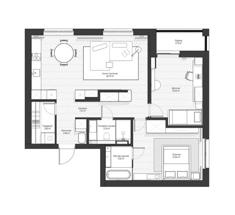
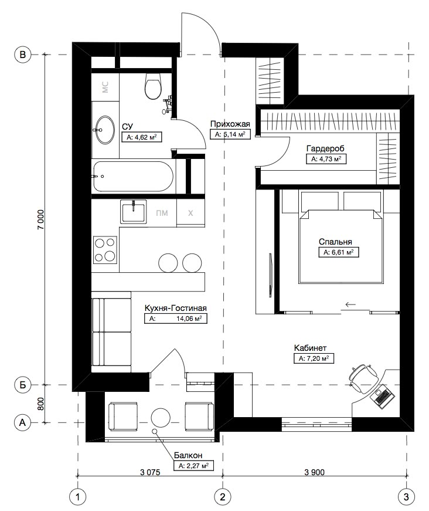
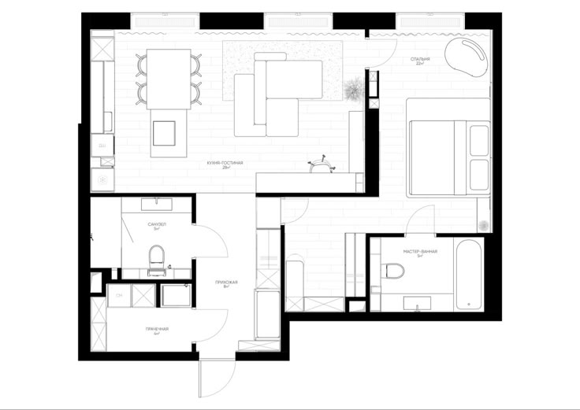
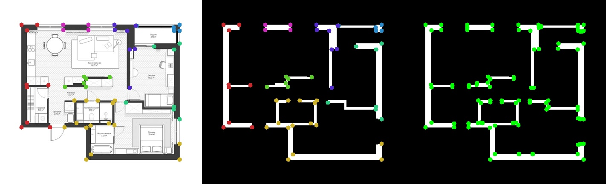
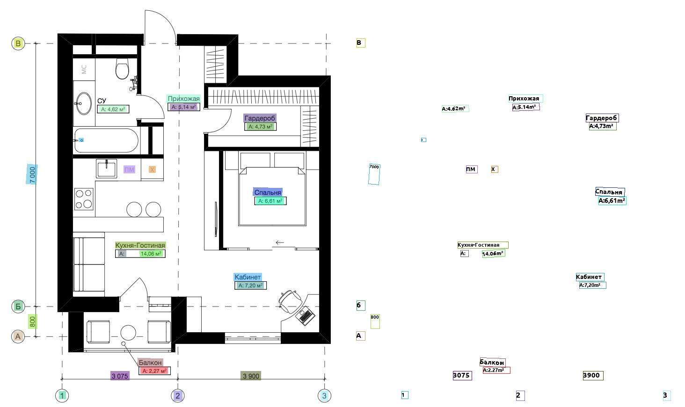

# Распознавание плана квартиры из изображения

## 🎯 Цель

Показать, как мы решаем задачу извлечения архитектурной геометрии из изображения и превращаем её в пригодный для 2D/3D 
формат.

## 🛠 Методология

Для решения данной задачи используется классический подход компьютерного зрения:

- Морфологические операции для удаления мелких деталей
- Нахождение контуров
- OCR как пример распознавания размеров

## 📊 Примеры изображений для эксперимента





В качестве эксперимента лучше использовать изображения с ярко выраженными стенами. Используются изображения разного 
разрешения для показа работоспособности подхода.

## 🧪 Секция с экспериментом

На представленном ниже изображении показано слева направо: план и преобразованное изображение с точками найденных 
контуров, преобразованное изображение с найденными углами, которые можно использовать для увеличения точности алгоритма.



На представленном ниже изображении показан результат работы OCR для распознавания текста и размеров на изображении.



## 🚀 Quick Start

При первом запуске для работы OCR может потребоваться VPN.

```bash
# Repository cloning
git clone https://github.com/UgryumovAV/plane_points.git

# Dependency installation
pip install opencv-python

# CPU
pip install paddlepaddle==3.2.0 -i https://www.paddlepaddle.org.cn/packages/stable/cpu/
# or GPU
pip install paddlepaddle-gpu==3.2.0 -i https://www.paddlepaddle.org.cn/packages/stable/cu118/

python -m pip install "paddleocr[all]"

# Starting the training process
python -m src.main